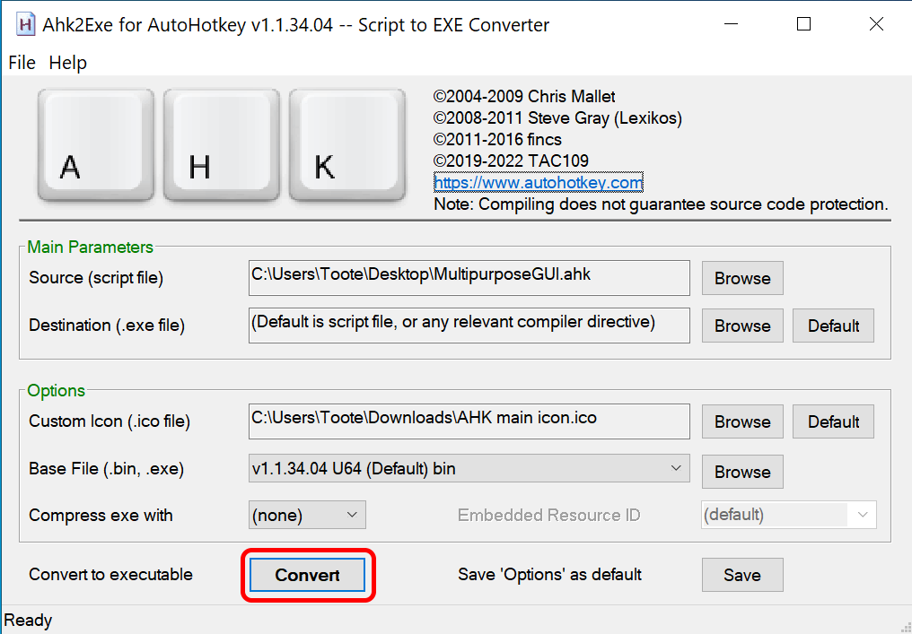

# AutoHotkey Custom Orders

The purpose of this repo is to provide [AutoHotkey](https://www.autohotkey.com/) ("AHK") files that can be used as a companion app for Minecraft and other various games. It does not require Minecraft (or even Java), but may require AutoHotkey itself to be installed in some circumstances (see below for details).

I (TooterTutor) initially created these files for the citizens of Cubeville, but these can be used by anyone. Feedback and pull requests are welcome!

AHK is a scriptable system that interfaces with Windows (and possibly other OSes) to give you features such as GUIs, Clipboard copy/paste, mouse and keyboard controls, and so on.

I have chosen to use AHK because of its large community of professionals who use it, helpful forums to answer questions, and the ease of its [scripting language](https://www.autohotkey.com/docs/AutoHotkey.htm).

# Source Code

The scripts provided here are not malicious, but for your own peace of mind, I provide the source code for you to verify (and modify if you would like).

The `.ahk` files are the plain-text script files. They can be edited in any text editor of your choice. Additionally, if you have AutoHotkey installed on your system, you can run and compile them yourself.

I am using AHK v1.1 as v2.x is currently in beta. I have not tested these with v2.

# Executables

For your convenience, I have compiled the `.ahk` files into a Windows binary. The steps to compile them yourself are found in their [official documentation](https://www.autohotkey.com/docs/Scripts.htm#ahk2exe), but I will provide simple instructions here as well. This way, you don't have to trust that the executables provided here haven't been tampered with.

According to their site:

> Once a script is compiled, it becomes a standalone executable; that is, AutoHotkey.exe is not required in order to run the script. The compilation process creates an executable file which contains the following: the AutoHotkey interpreter, the script, any files it includes, and any files it has incorporated via the FileInstall command.

# Compiling

You will need to install AutoHotkey if you wish to compile these scripts.

1. Download and install AutoHotkey from its official site. I've used v1.1 for these scripts and the executables. I do not know if these scripts are compatible with v2.

1. Right-click the script you want to compile and select "Compile Script (GUI)" as shown in image below:

1. After running the Compile Script (GUI) command, alter the settings to your liking, then press "Convert" and it will automatically compile. Your `.exe` file will be saved to wherever you specified in its *`Destination`* field.

You should now be able to run that executable directly, without requiring AutoHotkey open.
